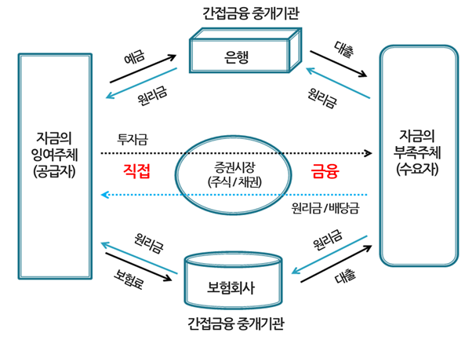

# Finance
- [금융](#금융)
- [금리](#금리)

<br />

## 금융
금융은 돈을 융통하는 것입니다.
```
융 : 녹여서 부드럽게 flexible
해 : 통하게 channeling & flows
```
- 금융의 3대 영역 : 은행, 보험, 증권
- 금융 시장(직접금융, 간접금융)
    - 직접금융 시장 : 주식, 채권 등의 증권 등을 발행하여 공급자와 수요자가 직접 자금을 거래.
    - 간접금융 시장 : 증권 발행 없이 자금공급자와 자금수요자 사이에 은행 등의 금융 중개 기관이 개재하는 금융시스템. 
    
    <br />
    <p align="center"></p>

<p align="center"></p>

## 금리
**실제 경제성장률** + **기대 인플레이션**이 영향을 끼치며 돈의 가치를 측정합니다.
- **상황에 따른 대처**
    - 경제성장 둔화 >> 금리 인하
    - 경제성장 과열 >> 금리 인상
    - 인플레이션이 높으면 실질 이윤(구매력)이과 자산의 가치가 하락하여 >> 금리 인상
    - 즉, 금리와 물가는 동행
